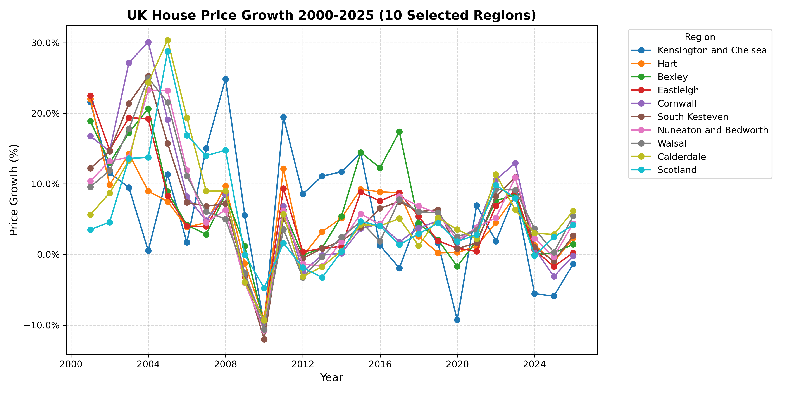
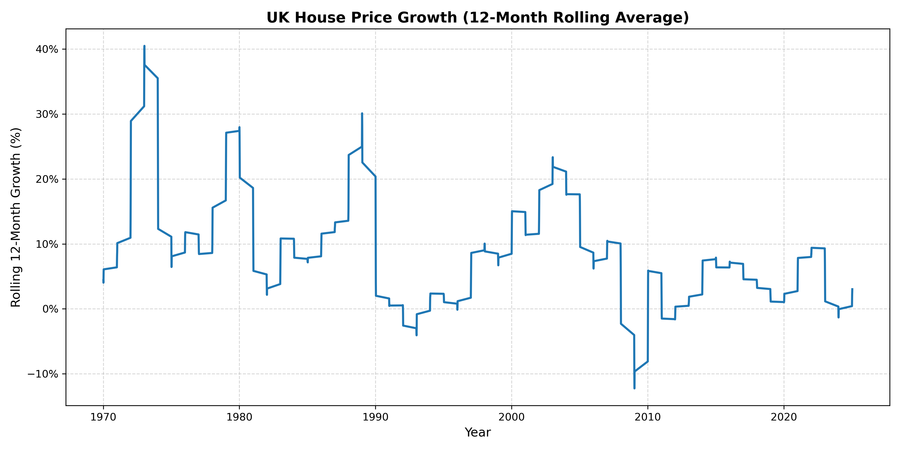
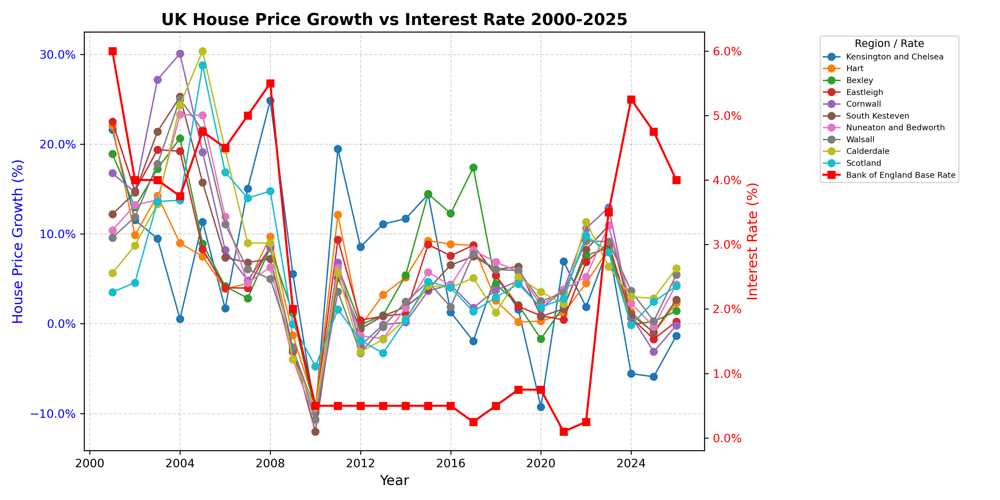
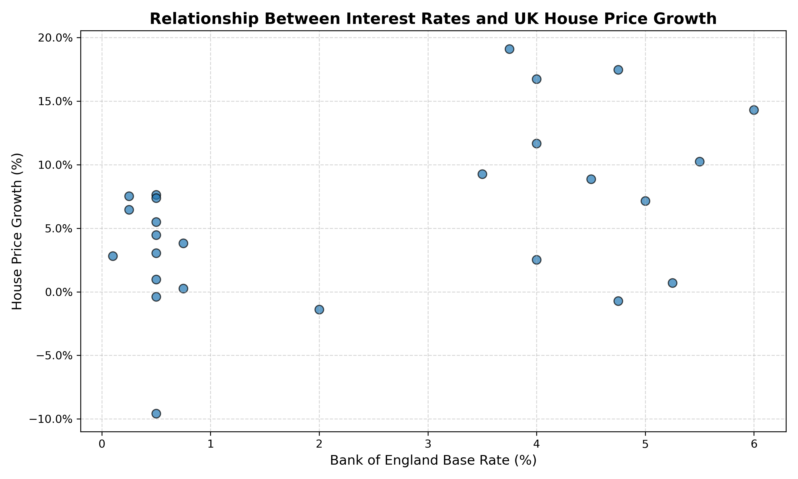

# UK-House-Prices (2000–2025)


Analysis of **UK house price trends across regions** and the **relationship with Bank of England interest rates**. Demonstrates **data analysis, visualization, and economic insight** using Python.

---

## Project Structure
```
Data/
   UK-House-Prices.csv
   Bank Rate history and data Bank of England Database.xlsx
house_price_analysis.py
plots/
README.md
```

- **Data:** Raw house price and interest rate datasets.  
- **Python script:** Processes data, generates metrics, and saves plots in `plots/`.  

---

## Visualizations

### House Prices by Region


### Annual House Price Growth


### Rolling 12-Month Growth


### House Price Growth vs Bank Rate


### Scatter Plot: Rate vs Growth


---

## Key Findings
- Significant **regional disparities** in house price growth.  
- **Interest rates influence house price growth**, with lagged rates showing predictive patterns.  
- Insights highlight **UK housing market dynamics** over the last two decades.  

---

## Skills Demonstrated
- **Data cleaning & preprocessing:** resampling, pivoting, handling missing values  
- **Data visualization:** line plots, dual-axis plots, scatter plots, rolling averages  
- **Economic analysis:** evaluating interest rate impacts on housing  
- **Python programming & reproducibility:** automated generation of professional plots  

---

## Usage
1. Clone the repo: 

```bash
git clone https://github.com/OliJDKirk/UK-House-Prices
```

2. Install libraries:

```bash
pip install pandas matplotlib numpy
```

3. Run analysis:  

```bash
python house_price_analysis.py
```

All visualizations are saved in `plots/`.
